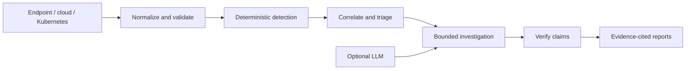

# Agentic Threat Hunter

[](https://github.com/shayb1187-a11y/agentic-threat-hunter/actions/workflows/ci.yml)
[](LICENSE)

[](https://shayb1187-a11y.github.io/agentic-threat-hunter/)

**Evidence-grounded threat hunting across endpoint, cloud, and Kubernetes telemetry.**

Agentic Threat Hunter (ATH) turns security events into explainable investigations:
normalize telemetry, detect suspicious behavior, correlate findings, investigate
through bounded evidence tools, and produce reports with traceable claims.

I built ATH to explore a practical engineering question: **where does an AI
investigator add value beyond deterministic detection?** The project includes the
application, regression tests, reproducible experiments, and measured failures.
The complete deterministic workflow runs offline after installation.

**Status:** working research prototype. Bounded investigations, typed evidence
verification, durable jobs and a checkpointed investigation workflow are implemented.
The first pre-registered model evaluation on fresh real data is done, and the model
**failed** its safety bar; the fix is in progress
([results](docs/holdout-v1-windows-results.md)). Production readiness and analyst time
savings have not been established.

**See it in a browser:** the [live demo](https://shayb1187-a11y.github.io/agentic-threat-hunter/)
shows detection, correlated cases, evidence-cited investigation reports and recorded
model runs, including the failure.

[Quick start](#quick-start) · [Architecture](#architecture) ·
[Measured results](#measured-results) · [Documentation](docs/README.md) ·
[Development guide](CONTRIBUTING.md)

## Review the project

| To understand… | Start here |
| --- | --- |
| The implementation | [Pipeline and package structure](#architecture) |
| Detection quality | [Detector catalog and examples](docs/project-reference.md#detections), [evaluation](docs/project-reference.md#detector-evaluation) |
| The AI trust boundary | [Typed evidence verification](docs/evidence-verification.md) |
| Backend reliability | [Jobs, retries, leases, and report revisions](docs/persistence-and-background-execution.md) |
| What experiments actually showed | [Measured results](#measured-results), [research index](docs/README.md#research-record) |
| How quality is checked | [CI workflow](.github/workflows/ci.yml), [tests](tests/), [development guide](CONTRIBUTING.md#validation) |

## Quick start

Requires Python **3.11 or newer**. From a terminal:

```bash
git clone https://github.com/shayb1187-a11y/agentic-threat-hunter.git
cd agentic-threat-hunter
python -m venv .venv
```

Activate the environment:

```bash
# Linux / macOS
source .venv/bin/activate
```

```powershell
# Windows PowerShell
.\.venv\Scripts\Activate.ps1
```

Install the package and build the offline demo (no API key, model or database;
about a minute):

```bash
python -m pip install -e ".[dev]"
ath demo --out demo-output --open
```

Or step through the pipeline yourself on the shipped synthetic data:

```bash
python main.py hunt --summary
python main.py chains
python main.py investigate --profile operational-v2 --no-llm --case CASE-001
python main.py jobs run --no-llm --json reports/local/jobs.json
python -m pytest -q
```

The demo needs no API key, model service, or database. `jobs run` uses in-memory
execution unless `ATH_DATABASE_URL` is configured; it produces v2 results and report
revisions. Use [the persistence guide](docs/persistence-and-background-execution.md)
for PostgreSQL-backed workers.

`ath` is the installed equivalent of `python main.py`; `ath --help` lists commands.
The shipped telemetry is ready to use. `python main.py generate` regenerates it.
For the legacy Markdown report example, run:

```bash
python main.py report --no-llm --case CASE-001 --stdout
```

That command runs a fresh legacy investigation; it does not render a previous v2
run. See the [full command reference](docs/project-reference.md#quick-start) for
imports, evaluation, visibility, and other workflows.

## Architecture



- **One telemetry contract.** Source adapters normalize events into a shared schema;
  detection and investigation use the same downstream pipeline.
- **Deterministic detection first.** 20 detection rules have KQL counterparts,
  evidence-gated ATT&CK mappings, and structural correlation.
- **Controlled model access.** Optional investigators use read-only evidence tools
  with budgets and explicit incomplete outcomes. Models cannot author `FACT` claims.
- **Verifiable outputs.** Reports separate facts, inferences, and hypotheses.
  Operational-v2 checks typed predicates; reference checks do not prove arbitrary
  model prose correct.
- **Durable execution.** Optional PostgreSQL jobs support leases, retries, attempt
  history, and report revisions.

**Stack:** Python, pandas, pytest, KQL, PostgreSQL (optional), LangGraph (optional),
local or hosted LLM integration (optional).

```text
src/ath/       Application package: telemetry → detection → investigation → reporting
  persistence/ Jobs, workers, leases, and report storage
  evaluation/  Detection metrics and investigation comparisons
  experiments/ Packaged experiment runner
tests/         Regression, integration, and evidence-contract tests
queries/       KQL detection counterparts
docs/          Application guides, technical reference, and research reports
experiments/   Declarative experiment specifications
notebooks/     Interactive and Colab workflows
scripts/       Data acquisition and research tooling
data/          Synthetic demo and external-data manifests
reports/       Recorded research evidence and generated outputs
```

All application components belong to the `ath` package. The supporting folders
provide data, validation, and reproducibility; they are not separate applications.
See the [development guide](CONTRIBUTING.md#where-changes-belong) for directory
responsibilities and the [technical reference](docs/project-reference.md#repository-layout)
for the detailed source map.

## Measured results

| Evaluation | Observed result | Scope |
| --- | --- | --- |
| Shipped synthetic demo | 1,118 events; 15 findings: 13 true positives, 2 false positives. Stage coverage: **12/12**. | Deliberately constructed labelled scenarios; not a production detection-rate estimate |
| External CloudTrail corpus (M18) | Management-record representation improved from 2/2,349 to 2,349/2,349 | Schema coverage for that corpus; not attack-detection accuracy |
| Frozen agent comparison (M19) | 22 cases from 8 corpora; on 21/22, the specialist crew differed from the deterministic arm in synthesis alone | Evidence of limited incremental value under those settings |
| **Pre-registered holdout, qwen3.5:9b vs deterministic** | **Not demonstrated.** On 12 fresh real Windows cases, the model called 0/6 attacks correctly and cleared 3 of them as benign; it called 5/6 benign cases correctly. The deterministic arm abstained on all 18 cases. | Rules sealed before any model call; 6 attacks from one DEDALE campaign; Kubernetes attack discrimination not evaluated. [Pre-registration](docs/holdout-v1-windows-preregistration.md) · [results](docs/holdout-v1-windows-results.md) |

The [synthetic evaluation](docs/project-reference.md#detector-evaluation),
[M18 report](docs/m18-representation-and-cloud-detection-report.md), and
[M19 report](docs/m19-ablation-report.md) explain the methods and limitations.
The earlier [synthetic authentication-to-execution pilot](docs/auth-execution-evaluation.md)
is dev evidence only: its cases were seen repeatedly while the profiles were tuned. The
holdout was built to avoid exactly that.

## Roadmap

| Track | Status |
| --- | --- |
| Detection, correlation, and offline investigations | Implemented |
| Bounded execution and typed evidence verification | Implemented: operational-v1 and operational-v2 |
| Durable investigation jobs | Implemented: in-memory and PostgreSQL stores |
| Operational profiles v3–v6 (reference catalogs, control-plane probes) | Implemented; frozen |
| Real-case evaluation, pre-registered holdout, HTML investigation reports | Implemented; first holdout: model not demonstrated |
| Operational-v7 benign guard (no benign call without the process's ancestry) | In progress; to be measured on a fresh holdout |
| Fresh Windows attack data for holdout-v2 | Planned |
| M19b cross-domain benchmark | Remaining frozen model runs blocked on API credit |
| M20 benign AWS study | Planned; tooling written, study not run |

The [research index](docs/README.md#research-record) and
[historical roadmap](docs/project-reference.md#roadmap) preserve the supporting work.

## Limitations

ATH is a research prototype, not a production SOC platform. Synthetic results do
not establish real-world accuracy. Model-authored prose still needs analyst review,
and no measured claim of analyst time savings is made. Full external corpora are
fetched separately; some historical freezes cannot be reproduced from a clone alone.

Read the [detailed limitations](docs/project-reference.md#limitations) and
[dataset provenance and redistribution notes](docs/project-reference.md#external-datasets)
when interpreting the results.
